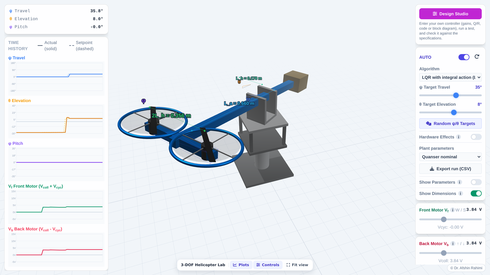
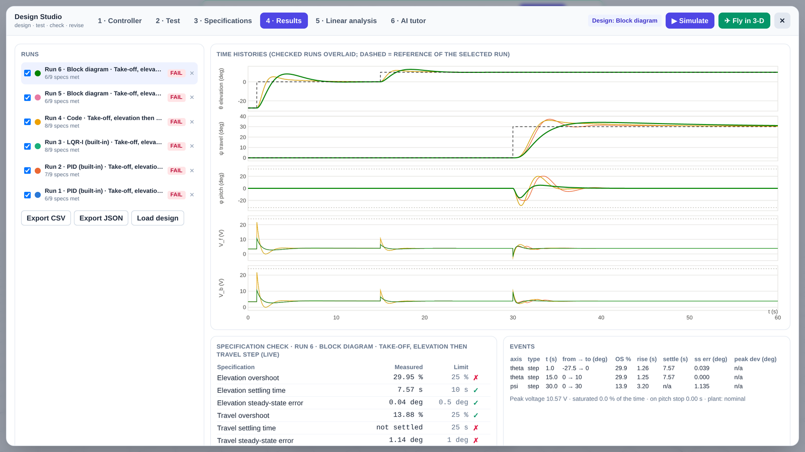

# 3-DOF Helicopter Virtual Lab

A browser-based control design lab for the Quanser 3-DOF helicopter. Students enter their own controller, run a defined test, check the result against specifications and a linear analysis, and revise, the same design loop they follow on the physical rig, without needing rig time or risking the hardware.

**Live demo:** https://drarahimi.github.io/quanser-3dof-design-lab/
**Demo video:** https://youtu.be/rex9OCwTNlI

Nothing to install: it runs in any modern browser with WebGL (tested in Chromium-based browsers such as Chrome and Edge). It also works on tablets and phones, though a laptop or desktop is best for the Design Studio.

## What students can do

The main view shows the 3-D unit with live plots of travel, elevation, pitch and the two motor voltages (left) and the controls (right).

* **Fly it by hand** (MANUAL): set the front and back motor voltages with the sliders, or with `W`/`S` (front) and `↑`/`↓` (back) (these keys can be switched off in the toolbar).
* **Let a controller fly it** (AUTO): choose cascaded PID or LQR with integral action, then set the travel and elevation targets.
* **Change the plant:** Quanser nominal parameters or an identified rig, with optional hardware effects (motor lag and encoder quantisation).
* **Export** the run as CSV, and show the model parameters or the unit's dimensions in the 3-D view.

Click **Design Studio** to open the design workflow:

| Tab | What it does |
|---|---|
| 1 Controller | Enter a controller four ways: **PID gains** for the built-in cascade; **LQR-I** by choosing Q and R (K is solved in the browser) or typing K; **your own JavaScript** (`init()` and `step()`, with templates and a code check); or a **block diagram** built by drag and drop (gains, sums, integrators, derivatives, saturations and more). |
| 2 Test | Pick a standard test (take-off, 90° travel step, ramp tracking, disturbance rejection, verification sequence, two fault tests) or define your own reference steps and ramps, disturbance torques, **faults** (rotor thrust loss, travel friction, encoder bias or stuck encoder; abrupt or gradual), initial conditions and hardware effects. |
| 3 Specifications | Pass/fail limits on overshoot, settling time, steady-state error, disturbance deviation, motor voltage and stop contact. Instructors can export a spec sheet and share it with the class. |
| 4 Results | Every run with PASS/FAIL, overlaid time histories, the spec check, per-event metrics, CSV/JSON export, "Load design" to go back to an earlier version, and a **Health monitor** panel: fault detection, isolation, estimated fault size and remaining-useful-life prediction. |
| 5 Linear analysis | Closed-loop poles (s-plane and table with ωn and ζ), phase and gain margins of each loop, and Bode plots. Works for **any** controller, including your own code and diagrams. |
| 6 AI tutor | Optional. Ask about your latest run; the tutor can run the simulator to test an idea before suggesting it. See below. |

**Simulate** runs the whole test instantly (a 60 s test takes about 0.1 s). **Fly in 3-D** runs the same test in real time on the 3-D unit, and the result appears in Results; both give identical numbers.

### A typical session
1. Open the Design Studio, choose a controller type and enter your design.
2. In **Test**, pick a standard test (or build one); in **Specifications**, check the limits your instructor set.
3. Click **Simulate**. Read the PASS/FAIL table and the overlaid plots in **Results**.
4. Use **Linear analysis** to see why (poles, damping, margins), revise the design and run again. Earlier runs stay in the list for comparison.
5. Click **Fly in 3-D** to watch the final design fly the test.

### View controls
* Drag to orbit, scroll or pinch to zoom, right-drag to pan the 3-D view.
* The toolbar at the bottom shows or hides the **Plots** and **Controls** panels and **Fit view** re-centres the unit. On small screens the panels open as drawers, one at a time.
* **Pause** freezes the simulation and all animation; **Motor keys** turns the `W`/`S`/`↑`/`↓` shortcuts on or off.

## Accessibility
The lab targets **WCAG 2.1 Level AA**, which covers the WCAG 2.0 AA requirement of Ontario's Integrated Accessibility Standards (AODA, O. Reg. 191/11).
* **Keyboard:** everything works without a mouse. `Tab` moves through the controls with a visible focus ring. In the 3-D view (focus it with `Tab`), the arrow keys orbit, `+`/`-` zoom and `Home` fits the view. The control diagram opens with `Enter` and closes with `Esc`.
* **Design Studio:** a modal dialog; `←`/`→` switch tabs, `Esc` closes it and returns focus. In the block-diagram editor, `Tab` to a block, `Enter` selects it, the arrow keys move it (`Shift` for larger steps), and the inspector's **Inputs** lists connect each input port, so diagrams can be built without dragging.
* **Screen readers:** all controls have names, sliders report their value with units, plots and diagrams have text alternatives (the numbers are in the tables and the CSV export), and run results, errors and health alarms are announced.
* **Motion:** animation can be paused, and the lab follows the operating system's "reduce motion" setting.
* **Checked with** axe-core 4.13 (no violations on the main view or any studio tab) and a scripted keyboard walkthrough. Automated tools cover only part of WCAG; please report any barrier you meet (open an issue), and an accessible alternative format of any material is available on request.

## Model and numerics
* Nonlinear model of the elevation, pitch and travel axes in SI units, driven by the front and back motor voltages, with the joint stops (pitch ±32°, elevation −27.5° to 36°).
* Two parameter sets: Quanser nominal values and an identified rig.
* Fixed-step fourth-order Runge-Kutta at 1 kHz with zero-order-hold control, independent of the screen's frame rate, so results do not depend on the computer.
* The physics and design tools were verified against independent Python references (integration accuracy, LQR gains, poles, margins and metrics); see the paper below.

## Fault diagnosis and prognosis
A health monitor runs in every test. It knows only the nominal model, the commanded voltages and the measured angles and rates, and estimates the torque on each axis that the model cannot explain (a generalized-momentum observer). From it the lab reports when a fault is detected, which rotor (or friction) it is and how large, and, for gradual thrust loss, the predicted remaining useful life. A good controller can hide a fault in the tracking error; the residual shows it. In Fly in 3-D the faulty rotor's guard ring turns red.

## AI tutor (optional)
* Uses the student's **own free Groq API key** (get one at https://console.groq.com/keys). The key is kept only for the session unless "Remember" is ticked.
* Requests go straight from the browser to Groq (or any OpenAI-compatible endpoint set in the tab). Only the controller design and run metrics are sent, never a name or ID.
* Models: `openai/gpt-oss-120b` (default), `openai/gpt-oss-20b`, `qwen/qwen3.8-27b`. Free-tier rate limits are respected automatically.
* Every tool call the tutor makes (reading the design, running a variant, running the linear analysis) is shown to the student. Instructors can forbid explicit gain values.
* The tutor can be wrong; check its claims against the plots and the spec table.

## Files
| File | Contents |
|---|---|
| `index.html` | The app: 3-D view, panels and toolbar |
| `sim-core.js` | Plant model, RK4 integrator, built-in PID and LQR-I controllers |
| `sim-design.js` | Design tools: Riccati and eigenvalue solvers, linear analysis and margins, tests, metrics, specs, code sandbox, block-diagram engine |
| `studio.js` | The Design Studio interface |
| `tutor-core.js` | The AI tutor (chat, simulator tools, rate-limit pacing) |

Static site with no build step. three.js, Tailwind CSS, KaTeX and Font Awesome are loaded from public CDNs.

**Run locally:** in this folder run `python -m http.server 8000`, then open http://localhost:8000/. (Opening `index.html` directly from disk may block the scripts in some browsers.)

## Citation
A. Rahimi, "A Browser-Based Control Design Lab for the Quanser 3-DOF Helicopter with an LLM Tutor," submitted to AIESC 2027.

## Acknowledgment
Supported by the Natural Sciences and Engineering Research Council of Canada (NSERC) through the Discovery Grants Program (RGPIN-2020-05513) and by the University of Windsor.

## Licence
© Afshin Rahimi, University of Windsor. All rights reserved until a licence is added.

Quanser is a trademark of Quanser Inc. This project is independent and is not affiliated with or endorsed by Quanser.
